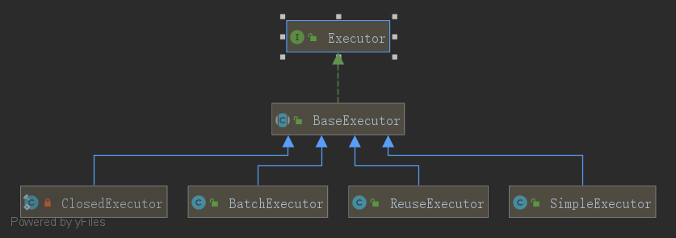
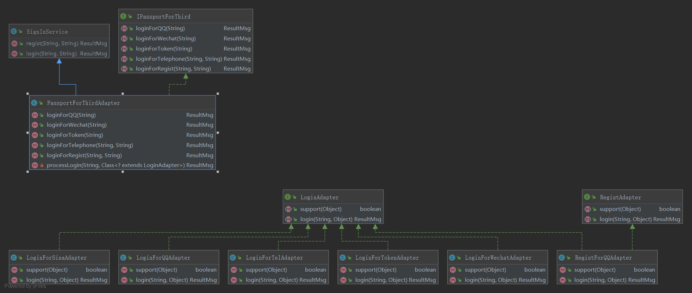

# 设计模式Demo

## 模版模式

### 定义
    模板模式(Template Pattern)通常又叫模板方法模式（Template Method Pattern）是指定义一个算法的骨架，并允许子类为一个或者多个步骤提供实现。
    模板方法使得子类可以在不改变算法结构的情况下，重新定义算法的某些步骤。
    属于行为性设计模式。
   
### 模版模式类图

### 模版模式的适用场景

    1、一次性实现一个算法的不变的部分，并将可变的行为留给子类来实现。
    2、各子类中公共的行为被提取出来并集中到一个公共的父类中，从而避免代码重复。

### 模版模式的优缺点

> 优点
   1、提高代码的复用性。
   2、提高代码的扩展性。
   3、符合开闭原则。

> 缺点
    1、类数目的增加。
    2、间接地增加了系统实现的复杂度。
    3、继承关系自身缺点，如果父类添加新的抽象方法，所有子类都要改一遍。
    

### 适配器模式
 
 ### 定义
     
     适配器模式（Adapter Pattern）是指将一个类的接口转换成客户期望的另一个接口，使原本的接口不兼容的类可以一起工作。
     属于结构型设计模式。
    
 ### 适配器模式类图
 
 

### 适配器模式的适用场景

    1、已经存在的类，它的方法和需求不匹配（方法结果相同或相似）的情况。
    2、适配器模式不是软件设计阶段考虑的设计模式，是随着软件维护，由于不同产品、不同厂家造成功能类似而接口不相同情况下的解决方案。

### 适配器模式的优缺点

> 优点
    1、能提高类的透明性和复用，现有的类复用但不需要改变。
    2、目标类和适配器类解耦，提高程序的扩展性。
    3、在很多业务场景中符合开闭原则。

> 缺点
    1、适配器编写过程需要全面考虑，可能会增加系统的复杂性。
    2、增加代码阅读难度，降低代码可读性，过多使用适配器会使系统代码变得凌乱。
    
    
